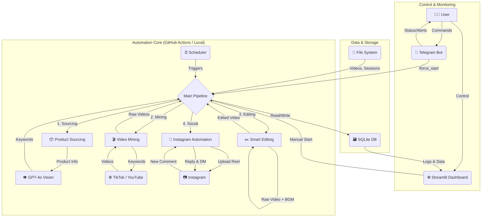

# 🤖 수익형 숏폼 자동화 봇 (SNS Marketing Automation Bot)

## 1. 프로젝트 개요

이 프로젝트는 쿠팡/아마존과 같은 이커머스 플랫폼의 상품을 소싱하고, 해당 상품의 바이럴 영상을 자동으로 제작하여 인스타그램 릴스에 업로드하는 **Python 기반 SNS 마케팅 자동화 시스템**입니다. 댓글과 DM을 통한 제휴 마케팅 링크 전송까지 자동화하여 수익 창출을 목표로 합니다.

모든 프로세스는 **Streamlit Cloud**와 **GitHub Actions** 환경에서 24시간 운영되도록 설계되었으며, **Telegram Bot**을 통해 실시간 제어 및 모니터링이 가능합니다.

### 주요 기능

- **🛍️ 자동 상품 소싱**: 쿠팡 '골드박스' 또는 '랭킹순' 페이지를 크롤링하여 인기 상품을 자동으로 발굴합니다.
- **👁️ AI 키워드 추출**: GPT-4o Vision API를 사용하여 상품 이미지로부터 정확한 영문 제품명과 해외 바이럴 영상 검색용 키워드를 추출합니다.
- **🎬 바이럴 영상 마이닝**: 추출된 키워드로 틱톡(TikTok)과 유튜브 쇼츠(Shorts)에서 조회수 높은 영상을 검색하고, 워터마크 없이 다운로드합니다.
- **✂️ 스마트 영상 편집**: 저작권 문제를 회피하고 바이럴을 유도하기 위해 다운로드한 영상을 자동으로 재가공합니다. (좌우 반전, 속도 조절, 확대, BGM 삽입, 후킹 자막 추가)
- **🚀 자동 업로드 및 소통**: 가공된 영상을 인스타그램 릴스에 자동으로 업로드하고, 댓글이 달리면 AI가 생성한 대댓글과 제휴 링크가 포함된 DM을 자동으로 발송합니다.
- **⚙️ 원격 제어 및 모니터링**: Streamlit 대시보드를 통해 전체 프로세스를 시각적으로 관리하고, Telegram 봇으로 언제 어디서든 봇의 상태를 확인하고 강제로 실행할 수 있습니다.

## 2. 시스템 아키텍처



## 3. 기술 스택

| 구분 | 기술 | 목적 |
| --- | --- | --- |
| **Language** | Python 3.9+ | 메인 개발 언어 |
| **Control Tower** | Streamlit, Telegram Bot | UI, 원격 제어 및 알림 |
| **Scheduler** | GitHub Actions | 주기적 자동 실행 (Cron Job) |
| **Database** | SQLite | 상품, 영상, 게시물 등 데이터 관리 |
| **Web Crawling** | `playwright` | 동적 웹 페이지(쿠팡) 크롤링 |
| **Video Download** | `yt-dlp` | 틱톡/유튜브 영상 다운로드 |
| **Video Editing** | `moviepy` | 영상 재가공 및 편집 |
| **AI / LLM** | `openai` (GPT-4o) | 상품명 분석, 캡션/자막 생성 |
| **Social API** | `instagrapi` | 인스타그램 릴스 업로드, DM/댓글 자동화 |

## 4. 설치 및 실행 가이드

### 4.1. 사전 준비

- Python 3.9 이상
- `ffmpeg` (시스템에 설치 필요)
- Git

### 4.2. 로컬 환경 설정

1.  **리포지토리 클론**

    ```bash
    git clone https://github.com/your-username/sns-marketing-bot.git
    cd sns-marketing-bot
    ```

2.  **가상환경 생성 및 활성화**

    ```bash
    python -m venv venv
    source venv/bin/activate  # macOS/Linux
    # venv\Scripts\activate    # Windows
    ```

3.  **필요 패키지 설치**

    ```bash
    pip install --upgrade pip
    pip install -r requirements.txt
    ```

4.  **Playwright 브라우저 설치**

    ```bash
    playwright install chromium
    playwright install-deps chromium # Linux 전용
    ```

5.  **API 키 및 자격증명 설정**

    `.streamlit/secrets.toml.example` 파일을 복사하여 `.streamlit/secrets.toml` 파일을 생성하고, 내부에 실제 API 키와 계정 정보를 입력합니다.

    ```bash
    mkdir -p .streamlit
    cp .streamlit/secrets.toml.example .streamlit/secrets.toml
    ```

    > **⚠️ 중요**: `secrets.toml` 파일은 절대 Git에 커밋하면 안 됩니다. `.gitignore`에 이미 포함되어 있습니다.

### 4.3. 실행

-   **Streamlit 대시보드 실행**

    ```bash
    streamlit run app.py
    ```

-   **터미널에서 직접 파이프라인 실행**

    ```bash
    python -m core.pipeline
    ```

## 5. GitHub Actions를 이용한 자동화

이 프로젝트는 GitHub Actions를 통해 주기적으로 자동 실행되도록 설정되어 있습니다. `.github/workflows/daily_run.yml` 파일을 참고하세요.

### 설정 방법

1.  자신의 GitHub 계정에 이 리포지토리를 Fork 또는 Push합니다.
2.  리포지토리의 `Settings > Secrets and variables > Actions`로 이동합니다.
3.  `New repository secret`을 클릭하여 아래의 Secret들을 모두 등록합니다. 이 값들은 로컬의 `secrets.toml` 파일과 동일한 값입니다.

    -   `OPENAI_API_KEY`
    -   `TELEGRAM_BOT_TOKEN`
    -   `TELEGRAM_CHAT_ID`
    -   `INSTAGRAM_USERNAME`
    -   `INSTAGRAM_PASSWORD`
    -   `COUPANG_ACCESS_KEY`
    -   `COUPANG_SECRET_KEY`
    -   `COUPANG_PARTNER_ID`

4.  GitHub Actions가 활성화되면, 설정된 스케줄(기본: 하루 3회)에 따라 자동으로 봇이 실행됩니다. `Actions` 탭에서 수동으로 실행(`workflow_dispatch`)할 수도 있습니다.

## 6. 중요: 인스타그램 세션 관리

인스타그램은 반복적인 로그인 시도를 봇으로 간주하여 계정을 일시적 또는 영구적으로 차단할 수 있습니다. 이를 방지하기 위해 이 프로젝트는 **로그인 세션(Session)을 파일로 저장하고 재사용**하는 로직을 구현했습니다.

-   최초 로그인 시 `sessions/ig_session.json` 파일이 생성됩니다.
-   이후 실행 시에는 이 세션 파일을 먼저 읽어 로그인을 시도하므로, 매번 아이디와 비밀번호를 입력할 필요가 없습니다.
-   **GitHub Actions 환경에서는 캐시(Cache) 기능을 이용해 세션 파일을 빌드 간에 유지합니다.**

> **경고**: 자동화는 인스타그램 서비스 약관에 위배될 수 있습니다. 계정 차단의 위험을 감수하고 사용해야 하며, 테스트용 부계정을 사용할 것을 강력히 권장합니다.

## 7. 프로젝트 구조

```
sns-marketing-bot/
├── .github/workflows/         # GitHub Actions 워크플로우
│   └── daily_run.yml
├── .streamlit/                # Streamlit 설정
│   └── secrets.toml.example
├── assets/bgm/                # 배경음악 (저작권 없는 mp3)
├── core/                      # 핵심 로직 모듈
│   ├── __init__.py
│   ├── sourcing.py            # 상품 소싱
│   ├── mining.py              # 영상 마이닝
│   ├── editing.py             # 영상 편집
│   ├── social.py              # 인스타그램 자동화
│   ├── bot.py                 # 텔레그램 봇
│   ├── pipeline.py            # 전체 파이프라인
│   └── database.py            # DB 관리
├── data/                      # 데이터 (DB, 임시 파일)
├── downloads/                 # 다운로드된 영상 (원본/편집본)
├── sessions/                  # 인스타그램 세션 파일
├── app.py                     # Streamlit 대시보드 앱
├── config.py                  # 중앙 설정 파일
├── requirements.txt           # Python 패키지 목록
├── README.md                  # 프로젝트 설명서
└── .gitignore                 # Git 제외 목록
```
